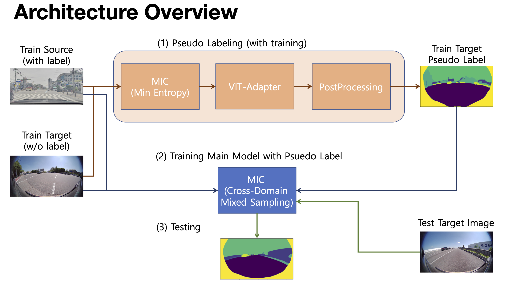

# Samsung AI Challenge 

## Architecture Overview

## Prerequist
To be relased

# Dataset
사용된 학습 데이터는 [2023 Samsung AI Challenge : Camera-Invariant Domain Adaptation
](https://dacon.io/competitions/official/236132/overview/description)에서 로그인 후 다운로드할 수 있음

## File Structure
To be relased

## Running Process
To be relased

## Trouble Shotting
Background label의 의미가 source domain(주행하는 차체), target domain(어안렌즈 바깥)에서 달랐기 때문에 MIC의 DACS 모듈을 직접 사용하기 어려움   
* Target domain에서도 Background를 잘 학습하기 위해 MIC(MinEnt)와 Vit-Adapter를 통해 pseudo label을 얻고 이것을 학습 데이터로 사용하여 재학습시킴 (3%의 성능 향상)
* 미처 잘 구분하지 못한 Background를 cv2.MORPH_ELLIPSE 모듈을 이용해 타원형으로 땀 (2% 성능 향상)

## Results
Private 13/212 (6.1%)

## References 
[Vit-Adapter](https://github.com/czczup/ViT-Adapter)  
[MIC](https://github.com/lhoyer/MIC)  
[mmsegmentation](https://github.com/open-mmlab/mmsegmentation)